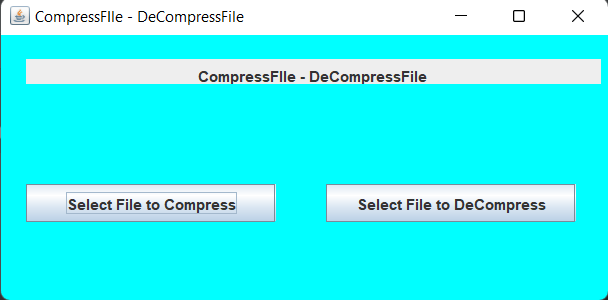

# File compresser and Decompresser Project

It is a Widow based platform independent application where we can reduse our larger files into smaller ones using gzip algorithm.


## Installation guide

compresser_decopresser

```bash
  *)  Fork the project comp_decomp on IDE
  *)  Go to main method and click on run
```
    
## Tech Stack

**Languages:** Java

**UserInterfece:** Java Swing


## Screenshots




## Feedback

If you have any suggetions or feedback, please reach out to us at harireddyakkati.91@gmail.com


## 🔗 Links

[](www.linkedin.com/in/harinath-akkati-3a8133177)


